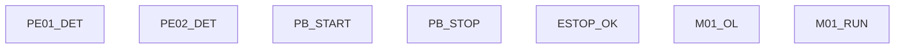

# Rewrite: Process flow diagram as Mermaid template fill

## Context

The process sequence diagram in `src/lib/process-sequence-diagram.ts` keeps producing bad layouts because it's trying to be a generic layout engine. Stop doing that. Instead, treat it as a TEMPLATE that gets filled from the matrix data.

The matrix already contains all the structured data we need. The job is just to output correct Mermaid `flowchart TD` syntax from that data. Mermaid handles the layout.

This file ONLY affects the process sequence flow diagram in the matrix review step. It does NOT affect the FB signal flow diagrams.

## Rewrite `src/lib/process-sequence-diagram.ts`

Delete the current implementation and replace it entirely. The new implementation uses `flowchart TD` (not `stateDiagram-v2`).

## Input data

The function receives a `ProcessSequence` from the matrix, which has:

```typescript
interface ProcessSequence {
  id: string;
  name: string;
  safetyConditions: Array<{ description: string; polarity: boolean; deviceName: string; }>;
  permissives: Array<{ description: string; polarity: boolean; deviceName: string; }>;
  steps: Array<{
    stepNumber: number;
    actions: Array<{ description: string; deviceName?: string; }>;
    transition: {
      conditions: Array<{ description: string; }>;
      combinator: "AND" | "OR";
    };
    devicesInvolved: string[];
    notes?: string;
  }>;
}
```

It also receives (add these as new parameters if not already available):

```typescript
interface ProcessFlowContext {
  // From the device list
  devices: Array<{
    name: string;
    tag: string;
    deviceType: string;
    instanceDbName: string;
  }>;
  // From the matrix device linkage
  deviceLinkage: Array<{
    name: string;
    instanceDbName: string;
    fbName: string;
    wiring: Array<{
      paramName: string;
      direction: "in" | "out";
      connectedTo: string;
      wireType: "fb" | "io" | "global" | "constant";
    }>;
  }>;
  // IO list
  ioList: Array<{
    tagName: string;
    signalType: "DI" | "DQ" | "AI" | "AQ";
  }>;
}
```

## The template

The Mermaid output follows this fixed structure. Every process flow diagram has these sections in order:

### 1. PHYSICAL INPUTS (always present)

One node per physical input signal from the IO list (DI and AI only).



Generate one node per DI/AI in the IO list. Node ID = `PI_{tagName}`. Use `:::input` class.

### 2. INPUTS DB (always present)

A single node representing the Inputs DB.

```mermaid
    %% Inputs DB
    IDB["Inputs DB"]:::db
    PI_PE01 --> IDB
    PI_PE02 --> IDB
    PI_PBSTART --> IDB
    PI_PBSTOP --> IDB
    PI_ESTOP --> IDB
    PI_OL --> IDB
    PI_RUN --> IDB
```

Every physical input connects to the Inputs DB node.

### 3. FB INSTANCES (always present)

One node per device FB instance. Show the instance name, FB type, and the KEY outputs that are used downstream (not all outputs — just the ones referenced in the matrix wiring or sequence steps).

```mermaid
    %% FB instances
    FB_PE01["InstPE01\nPE_Sensor\n→ _SensorDlyOnOff"]:::fb
    FB_PE02["InstPE02\nPE_Sensor\n→ _SensorDlyOnOff"]:::fb
    FB_PBSTART["InstPBSTART\nPushButton\n→ shortPress"]:::fb
    FB_PBSTOP["InstPBSTOP\nPushButton\n→ shortPress, longPress"]:::fb
    
    IDB --> FB_PE01
    IDB --> FB_PE02
    IDB --> FB_PBSTART
    IDB --> FB_PBSTOP
```

Generate from the deviceLinkage array. For each device that has a sensor/button type FB, connect from Inputs DB. Only list outputs that appear as sources in wiring entries for other devices.

### 4. SAFETY CONDITIONS (if any)

```mermaid
    %% Safety
    SAFETY{{"SAFETY\n✓ ESTOP_OK = TRUE\n✓ M01_OL = TRUE"}}:::safety
    SAFETY -->|Fail| FAULT["⚠ FAULT"]:::fault
```

Generate from `sequence.safetyConditions`. Each condition gets one line with ✓ or ✗ prefix based on polarity. Keep descriptions SHORT — max 25 chars, strip DB names and implementation details using the cleanLabel() function.

### 5. PERMISSIVES (if any)

```mermaid
    %% Permissives
    PERM{{"PERMISSIVES\n✓ No faults latched\n✓ One sensor active (XOR)"}}:::perm
    SAFETY -->|All OK| PERM
    PERM -->|Fail| IDLE
```

Same approach — from `sequence.permissives`, short labels.

### 6. SEQUENTIAL STEPS

This is where the branching logic matters. Process the steps array in order.

**Linear steps** (no OR/XOR in transition) — chain vertically:

```mermaid
    S10["Step 10: Start command\nPB_START.shortPress"]:::step
    PERM -->|Pass| S10
```

**Branching steps** (transition has OR combinator or actions contain direction-dependent logic):

DETECTION: A step needs branching when:
- Its transition combinator is "OR" with 2+ conditions, OR
- Its actions contain mutually exclusive alternatives (references to both forward AND reverse, or different devices for different conditions), OR
- The step after it has actions that differ based on a condition from this step

WHEN BRANCHING IS DETECTED — generate unique step numbers per branch:

```mermaid
    S10 --> XOR1{"XOR"}:::decision
    XOR1 -->|"PE01 active"| S20["Step 20: Direction = fwd"]:::step
    XOR1 -->|"PE02 active"| S70["Step 70: Direction = rev"]:::step
```

First branch gets step numbers: N+10, N+20, N+30, N+40
Second branch gets step numbers: N+50, N+60, N+70, N+75
Merge point gets: N+80

Each branch step shows its OWN specific action — not a generic description.

**FB call steps** — when a step's actions involve calling a device FB, show the FB as a node with key wired inputs:

```mermaid
    S30["Step 30: InstCV01\nControlConveyor\nrun ← PB_START.shortPress\ndirection ← FALSE\nendSensorFwd ← PE02.onOff"]:::fb_call
```

Pull the wiring from the deviceLinkage array for that device instance. Only show inputs that are relevant to this branch (e.g. forward branch shows endSensorForward, reverse branch shows endSensorReverse).

**Monitor steps** — waiting for a condition:

```mermaid
    S50["Step 50: Monitor forward\nWait PE02.onOff = TRUE"]:::monitor
    S50 -->|"PE02 detected"| S60
    S50 -->|"Fault"| FAULT
```

**Merge point** — where branches rejoin:

```mermaid
    S60 --> S120["Step 120: Confirm stopped\nM01_RUN = FALSE"]:::step
    S110 --> S120
    S120 -->|"5s timeout"| FAULT
    S120 -->|"Confirmed"| IDLE
```

### 7. IDLE / END

```mermaid
    IDLE(["Idle / Complete"]):::idle
```

### 8. OUTPUT PATH

Show motor/actuator outputs → Outputs DB → physical outputs:

```mermaid
    %% Output path
    FB_M01["InstM01\nControlMotor\nfwdRun, revRun"]:::fb
    OUTDB["Outputs DB"]:::db
    PO_FWD["M01_CMD_FWD"]:::output
    PO_REV["M01_CMD_REV"]:::output
    FB_M01 --> OUTDB
    OUTDB --> PO_FWD
    OUTDB --> PO_REV
```

### 9. STOP / FAULT HANDLING

```mermaid
    %% Stop and fault
    STOP["Normal stop\nPB_STOP.shortPress\n→ Remove run → idle"]:::stop
    ESTOP["E-Stop\nESTOP_OK = FALSE\n→ All OFF, latch F001"]:::fault
    RESET["Fault reset\nPB_STOP longPress 3s\n→ Clear latches → idle"]:::reset
```

### 10. STYLES (always appended)

```mermaid
    %% Styles
    classDef input fill:#0C447C,stroke:#85B7EB,color:#E6F1FB
    classDef output fill:#3B6D11,stroke:#97C459,color:#EAF3DE
    classDef db fill:#2C2C2A,stroke:#888780,color:#F1EFE8
    classDef fb fill:#085041,stroke:#5DCAA5,color:#E1F5EE
    classDef fb_call fill:#085041,stroke:#5DCAA5,color:#E1F5EE
    classDef step fill:#085041,stroke:#5DCAA5,color:#E1F5EE
    classDef monitor fill:#3C3489,stroke:#AFA9EC,color:#EEEDFE
    classDef safety fill:#3C3489,stroke:#AFA9EC,color:#EEEDFE
    classDef perm fill:#3C3489,stroke:#AFA9EC,color:#EEEDFE
    classDef decision fill:#2C2C2A,stroke:#888780,color:#F1EFE8
    classDef fault fill:#791F1F,stroke:#F09595,color:#FCEBEB
    classDef stop fill:#712B13,stroke:#F0997B,color:#FAECE7
    classDef reset fill:#712B13,stroke:#F0997B,color:#FAECE7
    classDef idle fill:#2C2C2A,stroke:#888780,color:#F1EFE8
```

## Function signature

```typescript
export function buildProcessFlowDiagram(
  sequence: ProcessSequence,
  context: ProcessFlowContext,
): string {
  // Returns complete Mermaid flowchart TD string
}
```

The function builds the Mermaid string by concatenating sections 1-10 above, filling in data from the sequence and context.

## Label rules

ALL labels in the diagram must be SHORT and use actual signal names:

- Step titles: "Step {N}: {short verb}" — max 30 chars
- FB wiring lines: "{param} ← {source}" — use instance names, not descriptions
- Transition labels: 1-4 words — "PE02 detected", "Pass", "Fail", "5s timeout"
- Safety/permissive lines: "✓ {signal} = {value}" — max 25 chars

Use the existing cleanLabel() function to strip DB prefixes, Inst prefixes, and verbose descriptions. If cleanLabel doesn't exist, create it:

```typescript
function cleanLabel(s: string): string {
  return s
    .replace(/\bInstDB_\w+\./g, "")
    .replace(/\b(FaultData|HmiData|SystemState|Configuration)\./g, "")
    .replace(/#/g, "")
    .replace(/:=/g, "←")
    .trim();
}

function truncate(s: string, max = 30): string {
  return s.length <= max ? s : s.substring(0, max - 3) + "...";
}
```

## Branching detection — generic rules

Do NOT hardcode conveyor/motor/sensor specific logic. The branching detection must work for ANY project:

1. Check if any step's transition has combinator "OR" with 2+ conditions — if yes, that step is a branch point
2. Check if any step's actions contain mutually exclusive device operations (references to different device instances doing the same type of thing) — if yes, split
3. After the branch point, assign unique step numbers per branch using the N+10/N+50 scheme
4. Find the merge point — the first step after the branches where both paths converge on the same action
5. If no branching is detected, render all steps as a straight linear chain

## What to pass from the matrix review component

In `src/components/forge/steps/forge-matrix-review.tsx`, the diagram is currently built with:

```typescript
const diagramChart = activeSeq ? buildMultiSequenceDiagram([activeSeq], activeSeq.id) : "";
```

Update this to also pass the context:

```typescript
const diagramChart = activeSeq
  ? buildProcessFlowDiagram(activeSeq, {
      devices: session.device_list ?? [],
      deviceLinkage: session.linkage_matrix?.deviceLinkage ?? [],
      ioList: session.io_list ?? [],
    })
  : "";
```

## Test

After implementation, the EFD-003 single conveyor project should produce a Mermaid flowchart showing:

1. 7 physical inputs → Inputs DB
2. 4 FB instances (PE01, PE02, PB_START, PB_STOP) with their key outputs
3. Safety conditions (ESTOP, OL)
4. Permissives (no faults, XOR sensor)
5. Step 10 (start) → XOR split
6. Forward branch: Steps 20→30→40→50→60 with InstCV01 and InstM01 FB calls showing wired inputs
7. Reverse branch: Steps 70→80→90→100→110 with different direction and sensor wiring
8. Merge at Step 120 (confirm stopped)
9. Output path: InstM01 → Outputs DB → M01_CMD_FWD, M01_CMD_REV
10. Stop/fault handling section

Every step should have unique numbers. No shared step numbers between branches.

Build and test with the single conveyor project.

Commit with: "forge-ui: rewrite process flow diagram as Mermaid template fill from matrix data"
