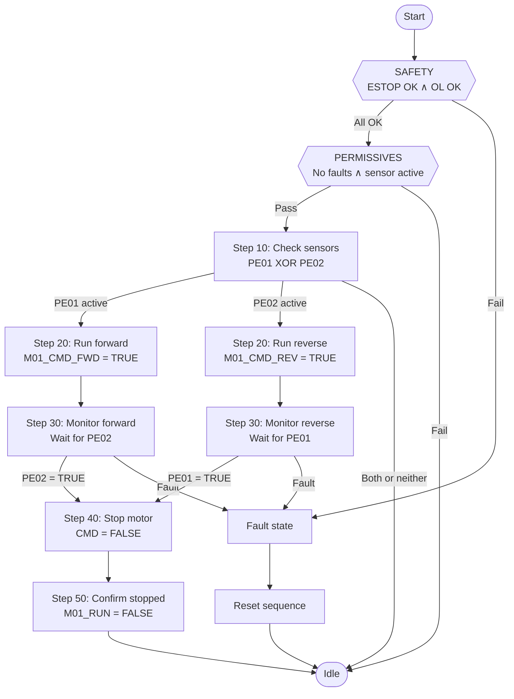

# Fix: Rewrite process sequence diagram as a proper sequential flowchart

## Problem

`src/lib/process-sequence-diagram.ts` generates a Mermaid `stateDiagram-v2` that renders ALL process steps as parallel branches fanning out from a single Permissives node. This creates an unreadable layout where everything spreads horizontally with truncated text and no clear flow direction.

The current code comment literally says: "Steps are rendered as parallel branches (CASE), not a linear chain." This is wrong for a process flow diagram. Process sequences ARE sequential — step 1 happens, then step 2, then step 3. They should be drawn as a top-down flowchart.

## Solution

Rewrite `buildSequenceDiagram()` to generate a Mermaid `flowchart TD` (top-down) instead of `stateDiagram-v2`. The diagram should show:

1. **Linear sequential flow** — steps go top to bottom in order
2. **Safety conditions** as the first node (always-monitored, any failure → fault)
3. **Permissives** as the second node (checked before sequence starts)
4. **Each step** as a numbered node with its action text
5. **Transitions** as labeled arrows between steps showing the condition to advance
6. **Decision splits** where a step has OR conditions — show as branching paths that rejoin
7. **Fault exits** as red-labeled arrows going to a Fault node
8. **Completion** returning to an end/idle node

## New diagram structure



## Implementation

### Rewrite `buildSequenceDiagram()` in `src/lib/process-sequence-diagram.ts`

The function receives a `ProcessSequence` which has:
- `safetyConditions[]` — each with description, polarity, deviceName
- `permissives[]` — each with description, polarity, deviceName
- `steps[]` — each with stepNumber, transition (conditions + combinator), actions[], devicesInvolved[], notes

Generate a `flowchart TD` with these rules:

```typescript
export function buildSequenceDiagram(sequence: ProcessSequence): string {
  const lines: string[] = ["flowchart TD"];
  
  // --- Safety conditions node ---
  if (sequence.safetyConditions.length > 0) {
    const safetyText = sequence.safetyConditions
      .map(sc => {
        const mark = sc.polarity ? "✓" : "✗";
        return `${mark} ${truncate(cleanLabel(sc.description), 35)}`;
      })
      .join("<br/>");
    lines.push(`    Safety{{"SAFETY<br/>${escapeLabel(safetyText)}"}}`);
    lines.push(`    Start(( )) --> Safety`);
    lines.push(`    Safety -->|Fail| Fault[/"⚠ FAULT"/]`);
  }
  
  // --- Permissives node ---
  if (sequence.permissives.length > 0) {
    const permText = sequence.permissives
      .map(p => {
        const mark = p.polarity ? "✓" : "✗";
        return `${mark} ${truncate(cleanLabel(p.description), 35)}`;
      })
      .join("<br/>");
    lines.push(`    Perm{{"PERMISSIVES<br/>${escapeLabel(permText)}"}}`);
    
    if (sequence.safetyConditions.length > 0) {
      lines.push(`    Safety -->|All OK| Perm`);
    } else {
      lines.push(`    Start(( )) --> Perm`);
    }
  }
  
  // --- Determine the entry point for steps ---
  const entryNode = sequence.permissives.length > 0 ? "Perm" 
    : sequence.safetyConditions.length > 0 ? "Safety" 
    : "Start";
  
  // --- Sequential steps ---
  let prevNode = entryNode;
  let prevLabel = sequence.permissives.length > 0 ? "Pass" : "All OK";
  
  for (let i = 0; i < sequence.steps.length; i++) {
    const step = sequence.steps[i];
    const stepId = `S${step.stepNumber}`;
    
    // Build the step node text
    const actionText = step.actions
      .slice(0, 3)
      .map(a => truncate(cleanLabel(a.description), 40))
      .join("<br/>");
    const stepLabel = `Step ${step.stepNumber}${actionText ? "<br/>" + actionText : ""}`;
    
    // Check if this step has OR conditions (branching)
    if (step.transition.combinator === "OR" && step.transition.conditions.length > 1) {
      // OR gate — this step branches into multiple paths
      // Each condition gets its own path
      lines.push(`    ${stepId}{"${escapeLabel(stepLabel)}"}`);
      lines.push(`    ${prevNode} -->|${escapeLabel(prevLabel)}| ${stepId}`);
      
      // Each OR condition branches to the next step
      // The branches will rejoin at the step AFTER this one
      for (const cond of step.transition.conditions) {
        const condLabel = truncate(cleanLabel(cond.description), 35);
        const nextStepId = i + 1 < sequence.steps.length 
          ? `S${sequence.steps[i + 1].stepNumber}` 
          : "End";
        lines.push(`    ${stepId} -->|${escapeLabel(condLabel)}| ${nextStepId}`);
      }
      
      // Don't set prevNode — the branches handle their own connections
      prevNode = "";
      prevLabel = "";
      continue;
    }
    
    // Normal sequential step — rectangle node
    lines.push(`    ${stepId}["${escapeLabel(stepLabel)}"]`);
    
    if (prevNode) {
      lines.push(`    ${prevNode} -->|${escapeLabel(prevLabel)}| ${stepId}`);
    }
    
    // Build transition label for the NEXT step
    if (step.transition.conditions.length > 0) {
      const transLabel = step.transition.conditions
        .map(c => truncate(cleanLabel(c.description), 35))
        .join(step.transition.combinator === "AND" ? " ∧ " : " ∨ ");
      prevLabel = transLabel;
    } else {
      prevLabel = "";
    }
    
    // Fault exit from this step (if it has fault-related devices or notes)
    const hasFaultExit = step.notes?.toLowerCase().includes("fault") 
      || step.actions.some(a => a.description.toLowerCase().includes("fault"))
      || step.devicesInvolved.some(d => d.toLowerCase().includes("estop"));
    if (hasFaultExit) {
      lines.push(`    ${stepId} -->|Fault| Fault`);
    }
    
    prevNode = stepId;
  }
  
  // --- End node ---
  lines.push(`    End([Idle / Complete])`);
  if (prevNode) {
    lines.push(`    ${prevNode} -->|${escapeLabel(prevLabel || "Done")}| End`);
  }
  
  // --- Fault node (if not already added) ---
  if (!lines.some(l => l.includes("Fault["))) {
    lines.push(`    Fault[/"⚠ FAULT"/]`);
  }
  
  // --- Styling ---
  lines.push(`    classDef safety fill:#3a1a50,stroke:#7F77DD,color:#e8e8e8`);
  lines.push(`    classDef perm fill:#2a2150,stroke:#7F77DD,color:#e8e8e8`);
  lines.push(`    classDef step fill:#0a3d35,stroke:#1D9E75,color:#e8e8e8`);
  lines.push(`    classDef fault fill:#3a1515,stroke:#E24B4A,color:#e8e8e8`);
  lines.push(`    classDef idle fill:#2a2a3e,stroke:#555,color:#e8e8e8`);
  
  if (sequence.safetyConditions.length > 0) lines.push(`    class Safety safety`);
  if (sequence.permissives.length > 0) lines.push(`    class Perm perm`);
  lines.push(`    class Fault fault`);
  lines.push(`    class Start,End idle`);
  
  // Apply step styling to all step nodes
  const stepIds = sequence.steps.map(s => `S${s.stepNumber}`);
  if (stepIds.length > 0) {
    lines.push(`    class ${stepIds.join(",")} step`);
  }
  
  return lines.join("\n");
}
```

### Key changes from the current code:

1. **`flowchart TD` instead of `stateDiagram-v2`** — proper top-down flowchart layout
2. **Sequential step ordering** — steps connect in order, not as parallel branches
3. **Decision nodes use `{{"text"}}` (hexagon)** for safety/permissive checks
4. **Normal steps use `["text"]` (rectangle)** for actions
5. **Start/end use `([text])` (stadium/rounded)** for idle states
6. **Fault node uses `[/"text"/]` (parallelogram)** to stand out visually
7. **OR conditions create branching paths** that rejoin at the next step
8. **AND conditions show as combined labels** on a single transition arrow
9. **Truncation is less aggressive** — 35-40 chars instead of 45, since flowchart nodes handle text better than state diagrams
10. **classDef styling** for color-coded nodes matching the app's dark theme

### Also fix the text truncation

The current `truncate()` cuts at 45 chars which still produces long labels. For flowchart nodes, shorter is better:

```typescript
function truncate(str: string, maxLen = 35): string {
  if (str.length <= maxLen) return str;
  return str.substring(0, maxLen - 3) + "...";
}
```

### Handle the `cleanLabel` function

Keep the existing `cleanLabel()` — it strips SCL prefixes and makes labels human-readable. But also add a new helper for step titles:

```typescript
function stepTitle(step: ProcessStep): string {
  if (step.actions.length === 0) return `Step ${step.stepNumber}`;
  // Use the first action as the title, cleaned up
  return `Step ${step.stepNumber}: ${truncate(cleanLabel(step.actions[0].description), 30)}`;
}
```

### Update the MermaidDiagram component if needed

Check `src/components/ui/mermaid-diagram.tsx` — it may need to be updated to handle `flowchart` syntax in addition to `stateDiagram-v2`. Mermaid.js supports both natively, so it should work without changes, but verify the theme configuration works with flowchart nodes.

### Handling branching paths with unique step numbers

CRITICAL: When a step branches (OR/XOR conditions), each branch MUST have its own unique step numbers. Steps doing different things cannot share a step number even if they're at the same "level" in the flow.

For example, the single conveyor sequence:
```
Start → Safety → Permissives → Step 10 (check sensors — XOR)
  → [PE01 active] Step 20 (set direction forward)
                  → Step 30 (start M01_CMD_FWD)
                  → Step 40 (monitor — wait PE02)
                  → Step 50 (stop M01_CMD_FWD)  ──┐
                                                   ├──→ Step 90 (confirm M01_RUN = FALSE) → Idle
  → [PE02 active] Step 60 (set direction reverse)  │
                  → Step 70 (start M01_CMD_REV)    │
                  → Step 80 (monitor — wait PE01)  │
                  → Step 85 (stop M01_CMD_REV)  ───┘
```

Each branch does different things (different CMD outputs, different sensors to monitor, different signals to clear), so each gets its own numbered steps. They merge back at a common "confirm stopped" step.

The diagram builder should detect branching (OR/XOR transitions) and generate unique IDs per branch path. When the matrix provides step data, the steps should already have unique numbers. If they don't, the builder should append a branch suffix (e.g. S30_A, S30_B) to avoid collisions.

### Test with the single conveyor project

After the rewrite, the "Conveyor Transfer Sequence" should render as a clean top-down flow with the XOR split producing two distinct parallel paths with different step numbers, merging back at the confirm/idle step. Not the current mess of parallel branches all fanning out from Permissives.

Commit with: "forge-ui: rewrite sequence diagram as sequential flowchart instead of parallel state diagram"
